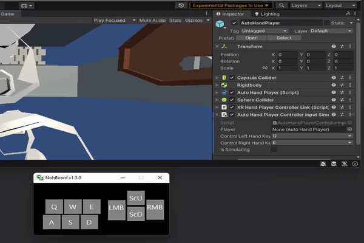

# AutoHandSimulator
A keyboard/mouse input to simulate movement and hand controls for the [AutoHand](https://assetstore.unity.com/packages/tools/physics/auto-hand-vr-physics-interaction-165323) package for Unity.

 

(Do you like the looks of it? - it's a work in progress. Follow me on [twitter](https://twitter.com/MTrobotics?ref_src=twsrc%5Etfw) , I will be sharing more about this game in the coming months :-) )

## Update! - Now includes basic hand control

 

To control hands, simply hold down Q for left hand and E for right hand and move the mouse, to move the hands up/down/left/right and scroll to move forward/backwards.

# Setup
* Setup [AutoHand](https://assetstore.unity.com/packages/tools/physics/auto-hand-vr-physics-interaction-165323) for Unity.
* Copy `Assets` folder into your project
* Make sure `Mock HMD` is enabled: `Go to Edit -> Project Settings-> XR Plug-in Management -> Mock HMD Loader`
* Attach the `AutoHandPlayerControllerInputSimulator.cs` to the **AutoHandPlayer**.
* If using unity version **2021.2.12f1**, make sure to enable the old input handler: `Go to Edit -> Project Settings->Player->` Under `Other Settings` under Configuration is the option `Active Input Handling`. Select `Both`.

The script should(!) detect whether the Mock HMD is used and only be effective, if that is the case. 
If that is **NOT** the case, the code will simply not run. 
Also, it is using pre-processor directives, so it won't compile for build versions, i.e. you should be able to just leave it there, even for a build version.

## Prerequisites
Requires: 
* The Mock HMD from unity, get it here: https://docs.unity3d.com/Packages/com.unity.xr.mock-hmd@1.0/manual/index.html
* The "old" input system from unity, which is the default for Autohand (AFAIK).
* The [AutoHand](https://assetstore.unity.com/packages/tools/physics/auto-hand-vr-physics-interaction-165323) package

## Known issues
In the Demo scene locomotion using the script occasionally does not work. I have not been able to reliably repreoduce the problem - a restart of Unity usually fixes it.

